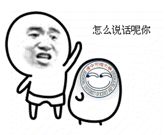
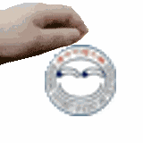
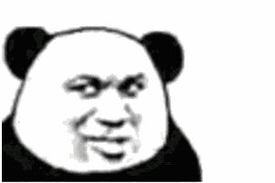
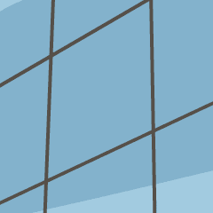
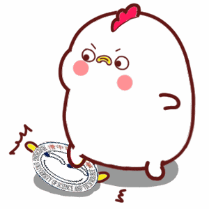

# Meme-with-QQavatar

## 简介

给定一个QQ号和指令，将获取其头像，制作成为一个有趣的表情包。非常适合作为QQbot的一个功能。


## 功能

### 丢


### 仰望大佬


### 打拳


### 打




### 摸头



### 摸鱼


### 摸


### 敲


### 赞



### 旋转


### 吃


### 吞


### 咬


### 快逃



### 色色


### 舔


### 拍


### 爬


### 推


### 踢


### 捂脸


### 踩



### 脆弱


### There will be more...


## 使用

### 依赖

- requests
- pillow

### 代码

``` python
testQQNum = 10000

# 格式应为：丢[@QQ号] 或者 丢QQ号
# 其中的 "丢" 表示要画 "丢" 这张图，可以换成其他指令
# 之所以支持 "[@QQ号]" 的格式是因为在大多数 qqbot 框架中，消息中的艾特是这种格式

testCommand = [
    "丢{}".format(testQQNum),
    "仰望大佬{}".format(testQQNum),
    "打拳{}".format(testQQNum),
    "打{}".format(testQQNum),
    "摸头{}".format(testQQNum),
    "摸鱼{}".format(testQQNum),
    "摸{}".format(testQQNum),
    "敲{}".format(testQQNum),
    "赞{}".format(testQQNum),
    "旋转{}".format(testQQNum),
    "吃{}".format(testQQNum),
    "吞{}".format(testQQNum),
    "咬[@{}]".format(testQQNum),
    "快逃[@{}]".format(testQQNum),
    "色色[@{}]".format(testQQNum),
    "舔[@{}]".format(testQQNum),
    "拍[@{}]".format(testQQNum),
    "爬[@{}]".format(testQQNum),
    "推[@{}]".format(testQQNum),
    "踢[@{}]".format(testQQNum),
    "捂脸[@{}]".format(testQQNum),
    "踩[@{}]".format(testQQNum),
    "脆弱{}".format(testQQNum),
]

tool = DrawTool()
for command in testCommand:
    result = tool.wantDraw(command)
    if result != None:
        # 如果成功的话，将拿到一个数组，里面是每个结果图片的本地绝对路径，有的命令会生成多张图
        print(result)
```


## 感谢

  怕瓦落地


